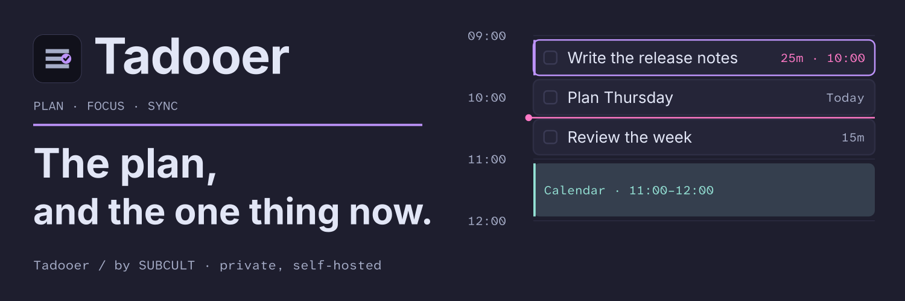

# Tadooer

> Private single-owner planner. Sample promotional artwork and copy pending owner review.

**The plan, and the one thing now.**

Here is the day. Your tasks sit beside the calendar. Choose one to work on.
The rest can wait in the list.

Tadooer is a private, self-hosted planner for one owner. There is no public
service or sign-up. The banner and opening lines are **sample promotional
artwork and copy, pending owner review**; the planner rows are placeholders.

## The day

Capture a task. Give it a project or a tag. Put a task into an available
calendar block. Start a focus session when you're ready.

The web app uses your server as the shared authority. A Linux desktop client
opens the same planner. An Android shell exists in source; no built APK or
device qualification is claimed. Connected calendars show their freshness,
and conflicting edits ask for a decision.

## The one thing now

One client controls the focus session. Another can follow it or explicitly
take over. Core task edits can queue while a browser is temporarily offline;
calendar and focus commands need a connection. A closed app does not receive
background updates.

Your owner account, calendar connections and server are your setup. This is
a single-owner tool, not a team subscription.

## Keep the working notes nearby

[DEVELOPMENT.md](DEVELOPMENT.md) preserves the full setup, implemented scope,
sync behavior, backup procedures and verification commands. The
[status record](docs/STATUS.md) separates shipped work from remaining gates.
The [design system](docs/design/README.md) describes the planner's visual rules.

The repository is `subculture-collective/tadooer`. Workspace packages and the
container image keep the historical `productivity-suite` name.
